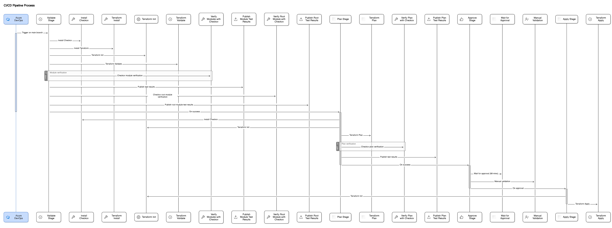

# az_checkov_tagging

## Overview

`az_checkov_tagging` is a Terraform-based project aimed at managing and enforcing Azure resource tagging policies using Checkov, a static code analysis tool for infrastructure-as-code (IaC). This project helps ensure that all Azure resources are appropriately tagged, which is crucial for resource management, billing, and compliance.

## Features

- Enforces tagging policies on Azure resources.
- Integrates with Checkov for static code analysis.
- Automates validation, planning, and applying Terraform configurations using Azure DevOps pipelines.
- Provides detailed reports for resource tagging compliance.

## Repository Structure

- `.gitignore`: Specifies files and directories to be ignored by Git.
- `main.tf`: Contains local variables defining tagging conventions.
- `providers.tf`: Configures the required providers for the project.
- `terraform-scan-plan-apply.yml`: An Azure DevOps pipeline file to automate the Terraform processes.
- `vnets.tf`: Defines Azure Virtual Networks with specific tagging.

## Prerequisites

- [Terraform](https://www.terraform.io/downloads.html) installed.
- [Checkov](https://www.checkov.io/) installed.
- Azure CLI installed and configured.
- Azure DevOps project set up with the necessary service connections and secrets.

## Installation

1. Clone the repository:
   ```bash
   git clone https://github.com/shankdub/az_checkov_tagging.git
   cd az_checkov_tagging
   ```

2. Initialize Terraform:
   ```bash
   terraform init
   ```

3. Install Checkov:
   ```bash
   pip install checkov
   ```

## Usage

### Running Terraform Locally

1. Validate the Terraform configuration:
   ```bash
   terraform validate
   ```

2. Plan the Terraform deployment:
   ```bash
   terraform plan -out=plan.tfout
   ```

3. Apply the Terraform plan:
   ```bash
   terraform apply "plan.tfout"
   ```

### Running Checkov

To scan the Terraform code with Checkov:
```bash
checkov -d . --output junitxml > checkov-report.xml
```

### Azure DevOps Pipeline

The repository includes an Azure DevOps pipeline (`terraform-scan-plan-apply.yml`) that automates the process of validating, planning, and applying Terraform configurations. This pipeline also includes steps for running Checkov to ensure compliance with tagging policies.

### Pipeline Configuration

#### Variables

The pipeline uses a variable group named `checkovtags`.

#### Trigger

The pipeline is triggered on changes to the `main` branch.

#### Stages

1. **Validate**:
    - Install Checkov.
    - Install Terraform.
    - Initialize Terraform.
    - Validate Terraform configuration.
    - Run Checkov on module and root files.
    - Publish Checkov test results.

2. **Plan**:
    - Install Checkov.
    - Initialize Terraform.
    - Plan Terraform deployment.
    - Convert the plan to JSON and run Checkov.
    - Publish Checkov test results.

3. **Approve**:
    - Manual validation step to review the plan before applying it.

4. **Apply**:
    - Initialize Terraform.
    - Apply the Terraform plan.

## Configuration

### main.tf

Defines local variables for the tagging conventions:
```hcl
locals {
  complete_tags = {
    Creator       = "terraform"
    projectNumber = "fs00023"
    environment   = "prod"
  }

  incomplete_tags = {
    Creator = "terraform"
    #projectNumber = "fs00023"
    environment = "prod"
  }
}
```

### providers.tf

Specifies the required providers:
```hcl
terraform {
  required_providers {
    azurerm = {
      source  = "hashicorp/azurerm"
      version = "~> 2.0"
    }
  }

  backend "azurerm" {}
}

provider "azurerm" {
  features {}
}
```

### vnets.tf

Defines Azure Virtual Networks with the necessary tags:
```hcl
resource "azurerm_virtual_network" "test_vnet_1" {
  name                = "checkov_vnet_1"
  resource_group_name = data.azurerm_resource_group.test_vnet_rg.name
  location            = data.azurerm_resource_group.test_vnet_rg.location
  address_space       = ["10.0.0.0/20"]
  tags = {
    Environment = "Development"
  }
}

resource "azurerm_virtual_network" "test_vnet_2" {
  name                = "checkov_vnet_2"
  resource_group_name = data.azurerm_resource_group.test_vnet_rg.name
  location            = data.azurerm_resource_group.test_vnet_rg.location
  address_space       = ["10.0.16.0/20"]
  tags = {
    Environment = "Development"
  }
}
```

## Azure DevOps Pipeline Sequence Diagram

The following sequence diagram illustrates the Azure DevOps pipeline used in this project:



## Contributing

Contributions are welcome! Please follow these steps:

1. Fork the repository.
2. Create a new branch: `git checkout -b my-feature-branch`
3. Make your changes and commit them: `git commit -m 'Add new feature'`
4. Push to the branch: `git push origin my-feature-branch`
5. Create a pull request.

## License

This project is licensed under the MIT License. See the [LICENSE](LICENSE) file for details.

## Contact

For any questions or suggestions, please open an issue or reach out to 

---

This README now accurately reflects the use of an Azure DevOps pipeline for the deployment process. Feel free to customize it further based on additional details or specific requirements.
